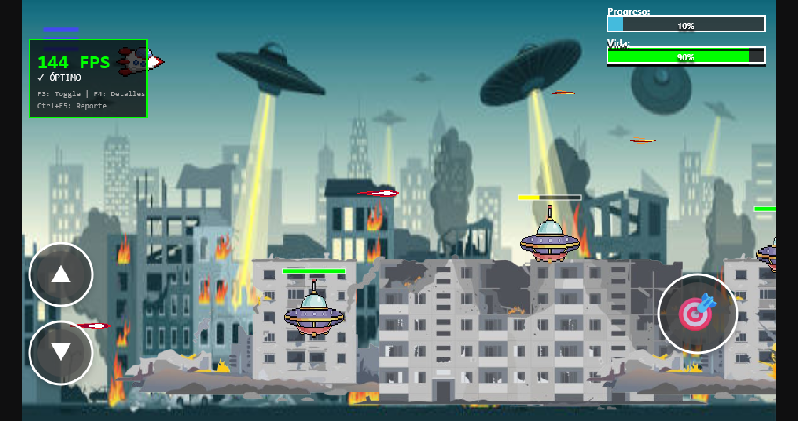
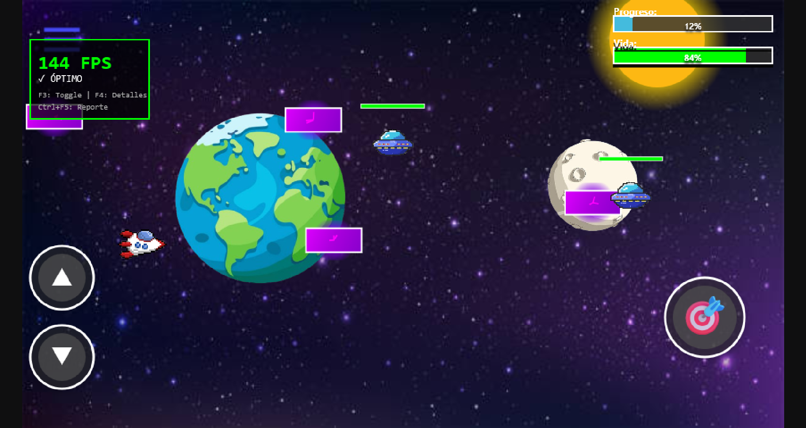
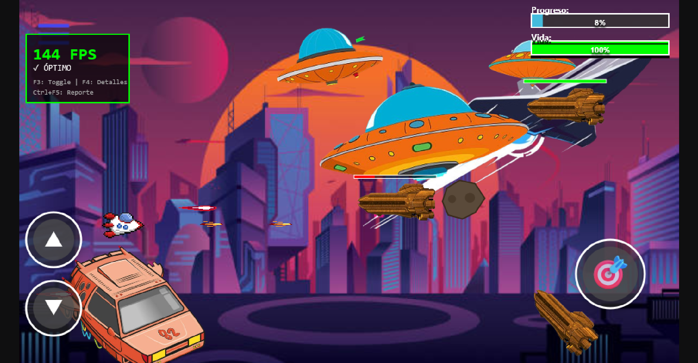

# SPACE 404 XY

Juego de naves espaciales tipo shooter desarrollado con HTML5 Canvas y JavaScript. Controla tu nave terrestre y defiende el espacio de oleadas de enemigos alienígenas a través de 3 niveles de dificultad creciente.

## Tabla de Contenidos

- [Características](#características)
- [Ejecución](#ejecución)
- [Controles](#controles)
- [Niveles](#niveles)
- [Estructura del Proyecto](#estructura-del-proyecto)
- [Tecnologías](#tecnologías)

## Características

- **3 Niveles de Dificultad**: Desde principiante hasta experto (facil, medio, dificil)
- **Sistema de Física**: Integración con Box2D para colisiones realistas
- **Efectos Visuales**: Asteroides, efectos de veneno, escudos y más
- **Audio Dinámico**: Música de fondo y efectos de sonido (Web Audio API)
- **Controles Táctiles**: Soporte completo para dispositivos móviles
- **Monitor de Rendimiento**: FPS counter y métricas de performance (F3/F4)
- **Responsive Design**: Se adapta a diferentes resoluciones manteniendo proporción 16:9
- **Sistema de Estados**: Menús, pausa, game over, victoria, configuración

## Ejecución

### Requisitos Previos

- Navegador web moderno (Chrome, Firefox, Edge, Safari)
- Servidor HTTP local (no funciona con `file://`)

### Opción 1: Python (Recomendado)

```bash
# Python 3
python -m http.server 8000

# Python 2
python -m SimpleHTTPServer 8000
```

Luego abre: `http://localhost:8000`

### Opción 2: VS Code (Live Server)

1. Instala la extensión "Live Server"
2. Click derecho en `index.html` → "Open with Live Server"

### Táctil (Móvil)

- **Botones en pantalla**: Controles movibles para arriba, abajo y disparar
- **Arrastrar**: Reposiciona los botones táctiles (modo configuración)
- **Click/Tap**: Interacción con menús y botones

### Ratón

- **Click**: Seleccionar opciones de menú
- **Arrastrar**: Ajustar sliders de volumen y contraste

## Niveles

### Nivel 1: Iniciación



**Características:**

- Enemigos básicos con patrones simples
- Velocidad moderada

### Nivel 2: Intermedio



**Características:**

- Enemigos más agresivos
- Disparos enemigos más frecuentes
- Enemigos con efecto de veneno

### Nivel 3: Experto



**Características:**

- Oleadas masivas de enemigos
- Patrones de movimiento complejos
- Asteroides de gran tamaño
- Mayor dificultad

## Estructura del Proyecto

```
SPACE-404-XY/
├── index.html              # Punto de entrada HTML
├── main.js                 # Inicialización y game loop
│
├── engine/                 # Motor del juego
│   ├── loader.js          # Carga de assets (imágenes)
│   └── stateManager.js    # Gestor de estados del juego
│
├── game/                   # Lógica del juego
│   ├── states/            # Estados del juego
│   │   ├── loadingState.js        # Pantalla de carga
│   │   ├── menuState.js           # Menú principal
│   │   ├── levelSelectState.js    # Selección de nivel
│   │   ├── settingsState.js       # Configuración
│   │   ├── controlsState.js       # Información de controles
│   │   ├── hudConfigState.js      # Configuración de HUD
│   │   ├── level1State.js         # Nivel 1
│   │   ├── level2State.js         # Nivel 2
│   │   ├── level3State.js         # Nivel 3
│   │   ├── pauseState.js          # Menú de pausa
│   │   ├── gameOverState.js       # Game Over
│   │   ├── levelCompleteState.js  # Victoria
│   │   ├── baseLevel.js           # Clase base para niveles
│   │   └── Box2dWeb-2.1.a.3.min.js # Física Box2D
│   │
│   └── utils/             # Utilidades
│       ├── audioManager.js        # Gestor de audio
│       ├── buttonManager.js       # Gestión de botones
│       ├── collisionHelpers.js    # Detección de colisiones
│       ├── entityManager.js       # Gestor de entidades
│       ├── performanceMonitor.js  # Monitor de rendimiento
│       ├── physicsManager.js      # Wrapper de Box2D
│       ├── renderHelpers.js       # Funciones de renderizado
│       ├── sliderManager.js       # Controles deslizantes
│       ├── touchControlsManager.js # Controles táctiles
│       └── uiHelpers.js           # Utilidades de UI
│
└── assets/                # Recursos del juego
    ├── audio/
    │   └── music/         # Música y efectos de sonido
    └── images/
        ├── escenarios/    # Fondos de niveles
        ├── fondos/        # Fondos de menú
        ├── icons/         # Iconos de UI
        ├── naves/         # Sprites de naves
        └── readme_images/ # Imágenes para documentación
```

### Arquitectura

#### Sistema de Estados

- Cada estado implementa: `enter()`, `update(dt)`, `render(ctx)`, `exit()`
- Transiciones suaves entre estados mediante `stateManager`
- Estados pueden compartir datos a través del gestor

#### Gestión de Entidades

- **EntityManager**: Centraliza balas, enemigos, balas enemigas y asteroides
- Actualización y limpieza automática de entidades fuera de pantalla
- Sistema de callbacks para lógica personalizada

#### Sistema de Física

- **PhysicsManager**: Wrapper de Box2D para física realista
- Detección de colisiones AABB y circular
- Soporte para cuerpos estáticos y dinámicos

#### Audio

- **AudioManager**: Singleton para gestión centralizada
- Música del menú vs música del juego
- Control de volumen independiente para música y efectos
- Persistencia de configuración en localStorage

#### Renderizado

- Canvas 2D con resolución base 960x540
- Escalado automático manteniendo aspect ratio
- Helpers para barras de progreso, efectos visuales y UI

## Tecnologías

- **HTML5 Canvas**: Renderizado 2D
- **JavaScript**: Módulos, clases, async/await
- **Box2D**: Motor de física 2D
- **Web Audio API**: Generación procedural de sonidos
- **localStorage**: Persistencia de configuración
- **CSS3**: Estilos y layout responsive

## Notas

- El juego requiere interacción del usuario para iniciar el audio (política de autoplay de navegadores)
- El monitor de rendimiento (F3) es útil para debugging en dispositivos con bajo rendimiento
- Los controles táctiles se pueden reposicionar desde el menú de configuración

## Créditos

Desarrollado como proyecto académico por Bautista Alexis y Ochoa Aubertin
